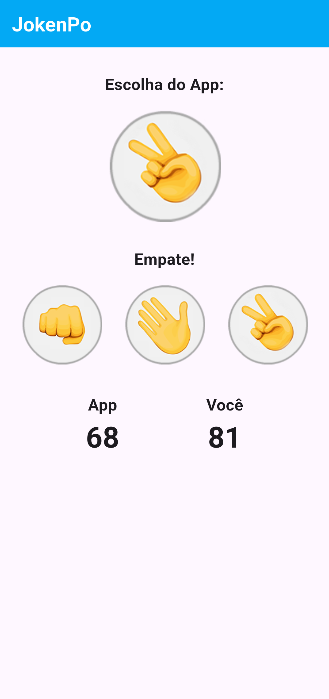

# 📱 JokenPo

Um aplicativo Flutter leve e interativo do clássico jogo **Pedra, Papel e Tesoura**. O usuário escolhe uma das três opções, o app faz uma escolha aleatória e exibe o resultado da rodada, informando se o jogador venceu, perdeu ou empatou. Ideal para se divertir de forma rápida e casual.

---

  🚧 <strong>Em construção</strong> 🚧 
  <em>Trabalhando nesta seção. Volte em breve! 🛠️</em>

## 🚀 Funcionalidades

- Escolha entre **Pedra**, **Papel** ou **Tesoura**
- O app seleciona uma opção aleatória automaticamente
- Exibição do resultado da rodada: vitória, derrota ou empate
- Mensagem instantânea com o resultado
- **Placar em tempo real** com contagem de vitórias e derrotas
- Interface simples, responsiva e compatível com Android e iOS

---

## 📸 Capturas de Tela

---

## 👩‍💻 Sobre a Desenvolvedora

  

  🌐 &nbsp;📱 &nbsp;☁️

  <b>Débora Almeida de Mello</b> 
  💻&nbsp;Desenvolvedora PHP, Flutter & Backend

---

<table>
  <tr>
    <td align="center">
      <h3>📊 Linguagens mais usadas</h3>
      
    </td>
    <td align="center">
      <h3>📈 Atividade no GitHub</h3>
      
    </td>
  </tr>
</table>

---

## 📄 Licença

Este projeto está licenciado sob a [MIT License](LICENSE).